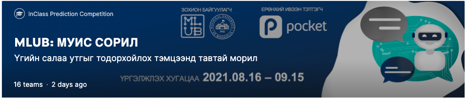

# MLUB-MUIS-CHALLENGE - 1st Place Solution

[](https://www.kaggle.com/c/muis-challenge/)

## Goal:

It is easy for a person to understand the meaning of a word from a sentence, but it is difficult for a machine, especially in the Mongolian language, where there is little natural language processing and research.
Therefore, the goal of the competition is to create a model for guessing the meaning of the different words in a given sentence.

> Translated by Google

## Usage of this repo
- Used as local module [1st place solution notebook](https://www.kaggle.com/bayartsogtya/mlub-muis-soril-1)
    - Custom dataset code `dataset.py`
    - Custom model code `models.py`
    - Custom preprocessing code `preprocessing.py`
- [HuggingFace Hub API](https://github.com/huggingface/huggingface_hub) Integration `train.py`
    - Faster and stardardized save&load loop
    - Runtime model git-like version control (Git-LFS)
- [Kaggle API](https://github.com/Kaggle/kaggle-api) Integration `train.py`
    - Submit the result to kaggle in runtime


## Requirements
- Python 3.6+

## Installation
```
python3 -m venv venv
source venv/bin/activate
pip install -r requirements.txt
```

## Train
Configure huggingface model hub credential
```
huggingface-cli login
```

Configure the kaggle credential.
```
cp /path/to/downloaded/kaggle.json ~/.kaggle/
```

Start training
```
bash train.sh
```

## Evaluation
| Model | Type | Parameters(M) | CV* | Public LB | Private LB |
| - | - | - | - | - | - |
| albert-base | uncased | 11 | 0.951 | 0.95290 | 0.95759 |
| gpt-2 | uncased | 117 | 0.943 | 0.93892 | 0.94350 | 
| roberta-large | uncased | 335 | 0.958 | 0.95924 | 0.96323 |
| bert-base | uncased | 110 | 0.970 | 0.96699 | 0.97098 |
| bert-large| cased| 335| 0.971| 0.96805| **0.97310** | 
| bert-large | uncased | 335 | 0.971 | **0.97016** | 0.97251 |

*CV - 5-fold Cross Validation

## References:
1. MLUB-МУИС-Сорил https://www.kaggle.com/c/muis-challenge
2. 1-р байрны шийдэл https://www.kaggle.com/bayartsogtya/mlub-muis-soril-1
3. Шийдлийн кодыг агуулсан Github repository https://github.com/bayartsogt-ya/mlub-muis-soril
4. Mongolian BERT https://github.com/tugstugi/mongolian-bert
5. HuggingFace дээрх Mongolian BERT https://huggingface.co/tugstugi
6. ALBERT-Mongolian https://huggingface.co/bayartsogt/albert-mongolian
7. Mongolian GPT2 https://huggingface.co/bayartsogt/mongolian-gpt2
8. Mongolian RoBERTa Large https://huggingface.co/bayartsogt/mongolian-roberta-large
9. Transformers Multiple Choice Model https://huggingface.co/transformers/model_doc/auto.html#automodelformultiplechoice
10. Stratified KFold Cross Validation https://scikit-learn.org/stable/modules/generated/sklearn.model_selection.StratifiedKFold.html